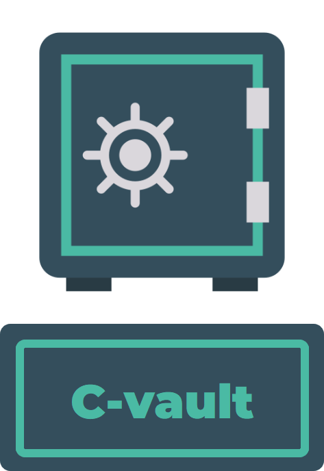

# C-Vault: Customs Declarations Management System

## Overview
C-Vault is a dedicated solution designed for efficiently managing and archiving customs declarations. It offers a range of key features aimed at simplifying the process of handling customs documents, ensuring security, accessibility, and ease of use.

---

## Developed for Lebanese Customs
In the wake of the devastating Port Beirut blast in 2020, which resulted in the significant loss of customs declarations, there was an urgent need for a robust and reliable system to manage and safeguard these critical documents. C-Vault was developed specifically to address this need for the Lebanese Customs Authority.

This system is designed to provide a secure, efficient, and user-friendly solution for the archiving and management of customs declarations. By leveraging advanced technologies and implementing stringent security measures, C-Vault ensures the preservation and accessibility of customs records, thereby mitigating the risk of future data losses.

Key benefits for the Lebanese Customs Authority include:
- Enhanced data security through encrypted communications and role-based access control.
- Comprehensive archiving capabilities that prevent duplicate records and maintain a history of changes.
- Improved accessibility with multi-user support and centralized database management.
- Streamlined document management processes that facilitate the easy retrieval, updating, and reporting of customs declarations.

C-Vault represents a significant step forward in modernizing the customs declaration management infrastructure, ensuring resilience against potential future disruptions and enhancing operational efficiency.

---

## Key Features

- ### Archive
    - Select files from a source directory
    - Save to SQL database
    - Avoid duplicates

- ### Read
    - Open scanned PDF files of Customs Declaration using default PDF viewer (e.g., SumatraPDF)
    - Report generation for authorized users
    - History retrieval for authorized users

- ### Update
    - Maintain version history
    - Track changes made to Customs Declarations (PDF files)

- ### Delete (with history)
    - Soft delete: Flag files as deleted
    - Maintain file history even after deletion

- ### User Management
    - Super Admin: Create and manage users, change roles and permissions
    - Regular Users: Read, archive, update, and delete (within their privileges)
    - Role-Based Access Control (RBAC)

---

## Technologies Used
- **cryptography**: A library providing cryptographic recipes and primitives.
- **CTkMessagebox**: A library for creating message boxes in customtkinter.
- **customtkinter**: A modern and customizable GUI library based on Tkinter.
- **mysql-connector-python**: A library for connecting to MySQL databases.
- **pillow**: A library for image processing.
- **PyGetWindow**: A library for obtaining information about window properties.

---

## Functions Overview

- ### Archive Functionality
    - Select files from a source directory
    - Save to SQL database
    - Avoid duplicates

- ### Read Functionality
    - Open scanned PDF files of Customs Declaration using default PDF viewer (e.g., SumatraPDF)
    - Report generation for authorized users
    - History retrieval for authorized users

- ### Update Functionality
    - Maintain version history
    - Track changes made to Customs Declarations (PDF files)

- ### Delete Functionality
    - Soft delete: Flag files as deleted
    - Maintain file history even after deletion

---

## User Roles And Privileges

- ### Super Admin:
    - Create and manage users
    - Change roles and permissions

- ### Regular Users:
    - Read, archive, update, and delete (within their privileges)

- ### Role-Based Access Control (RBAC)

---

## Multi-user Environment

- Multiple desktop installations
- Connection to a central server
- IP address and port configuration during installation
- Centralized database management

---

## Security Measures

- Encrypted communication between clients and server
- Role-based access control
- Super Admin controls IP address changes
- Regular backups of the database

---

## Installation Process

- Step-by-step guide for installing C-vault
- Configuration of IP address and port number
- Super Admin privileges during installation

---

## Reporting And History

- ### Report Generation:
    - CSV files with document details (Microsoft Excel sheet)
    - Accessible by authorized users

- ### History Tracking:
    - CSV files for each version (Microsoft Excel sheet)
    - Detailed history of changes made

---

## Super Admin Controls
- User Management:
  - Create, delete, update users
  - Change roles and permissions
- Centralized IP Address Control:
  - Enhancing security and control

---

## Conclusion
C-Vault offers a comprehensive solution for efficiently managing and archiving customs declarations. With its robust features, user-friendly interface, and emphasis on security, it is an ideal choice for organizations seeking to streamline their customs document management processes.

---

## License
This project is licensed under the [END-USER LICENSE AGREEMENT (EULA)](LICENSE).

---

## Author
- Emad &nbsp; E>
  
  

---

## Contact
For more details or inquiries, please contact:

- **Email:** &nbsp; [emadsaab222@gmail.com](mailto:emadsaab222@gmail.com)

  <!--  -->
